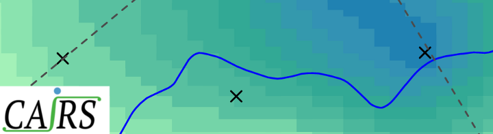
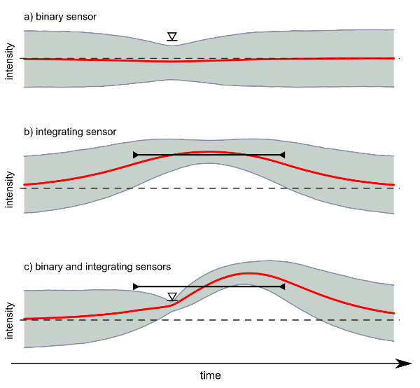
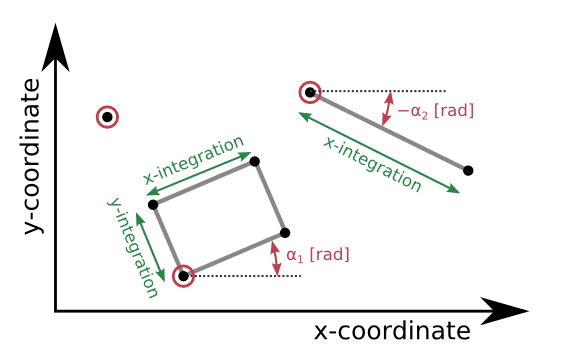
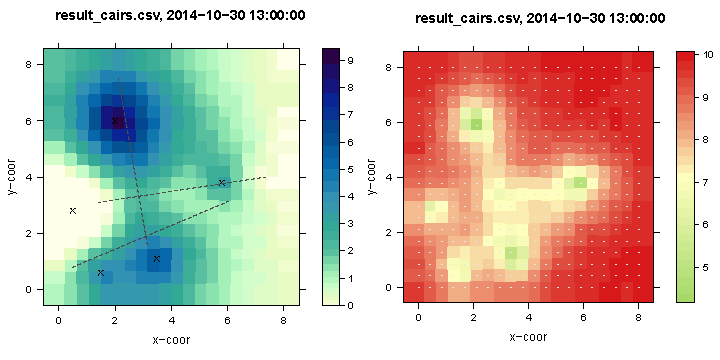

CAIRS  tutorial - reconstruction of rain fields from microwave links and other sensors
===================================================================================



This tutorial demonstrates the basic functionality of
[_CAIRS_](https://github.com/scheidan/CAIRS.jl). Download this tutorial as [pdf](https://gitprint.com/scheidan/CAIRS-Tutorial/blob/master/README.md).


Introduction
============


It is impossible to measure the rain field at every point in time
and space with rain gauges and microwave links (MWL).  Hence, some
_interpolation_ between the measurements is required. Traditional
methods to interpolate between rain gauge measurements are Thiessen
polygons or inverse distance weighting. While very simple to
implement, these methods do not allow to consider measurement
uncertainty, which requires more formal methods such as Kriging.

All the methods mention above are designed to interpolate between
_point_ measurements and are therefore not suitable to interpolate MWL
measurements, which are measurements along a line. Therefore, a more general
 interpolation method is needed.

This tutorial demonstrates how MWL measurements can be interpolated using
 _CAIRS_ (Continuous Assimilation of Integrating Rain Sensors).  _CAIRS_
 is a general framework to reconstruct (interpolate) rain fields by
 assimilating (combining) signals of sensors that can be fundamentally different.

In particular, _CAIRS_ considers the *integration characteristics* of
sensors explicitly. This is important because many sensors do not
measure the rain intensity at one point in time and space, but the
rain intensity integrated over time and/or space. For example,
non-recording standard rain gauges integrate over time and deliver
information such as the daily rainfall sums. The rain-induced
attenuation of microwave links (MWL) measures the rain intensities
integrated along a path - an example of a sensor with spatial
integration.


The one-dimensional example shown in the image below demonstrates the
importance of a correct consideration of different integration
characteristics. It shows the assimilation of a binary and an
integrating sensor. The red curve represents the mean of the
predictive distribution after assimilation, the gray area its
90%-credibility region. The signal of the binary sensors provides only
the information that the intensity is below a certain level (a). The
integrating sensor measures the average intensity over the time-span
indicated by the black line in b). In c) the assimilation of both
sensors is shown. In combination the two very different signals enable
a quite detailed reconstruction of the rain intensity. _CAIRS_
works similar in all three dimensions (two spatial and time).




_CAIRS_ is flexible in other respects too:

- As shown in the example above sensor signals on different scales
(e.g. continuous, binary) can be assimilated

- Non-Gaussian and non-linear observation models for sensors are
possible

- It is basedon a continuous formulation in time and space, i.e. the
model is not based on fix time-steps or grid representations. This
enables a natural handling of signals with irregular time-intervals.

For information on how the assimilation is done mathematically see
[Scheidegger and Rieckermann (2014)](#publication).


This tutorial was compiled for the [Rain Cell Africa
Workshop](http://raincell01.sciencesconf.org/) in Ouagadougo.
The reminder of it consist of:

1. A description of the [installation](#installation) of _CAIRS_

2. A first [example](#ex1) with artificial data

3. A [demonstration](#ex2) of the assimilation of real measurements


Installation
==============
<a name="installation"></a>

_CAIRS_ is a free software under GLP license and available as [Julia](http://julialang.org/) package.

The first step is to download and install
Julia (http://julialang.org/downloads/).
_CAIRS_ can then be installed with the Julia command `Pkg.clone()`:

```Julia
Pkg.clone("git://github.com/scheidan/CAIRS.jl.git")
```

After that, _CAIRS_ behaves like a normal package. For example, it can
be updated with `Pkg.update()`.

One possibility to visualize the output of _CAIRS_ is to use the
statistical software package [R](http://www.r-project.org/). It can be
downloaded for free from [here](http://cran.rstudio.com/).  The R-code
used for the visualization in this tutorial required the installation
of two R-packages. To install the packages type in the R prompt:
```R
install.packages(c("latticeExtra", "tripack"))
```


Example with artificial data
============================
<a name="ex1"></a>

The fundamental steps to compute a map of a rain field based on different signals consist of:

1. Definition of the sensor types. A sensor is specified with an
probabilistic observation model that describes the measurement errors
and, if applicable,  by defining the integration domain.

2. Define prior assumptions of the rain field, i.e. describe assumption
about temporal and spatial correlation.

3. Load the measured signals. Every signal has the corresponding
sensor type and location attached.

4. Define the points where the rain field should be interpolated.

5. Optional: visualize the rain field.


The reminder of this section explains how to implement this steps. All code for
this example can be found in the file `scripts/Example_1.jl`.

### Preliminaries

First, the package _CAIRS_ must be loaded. For convenience, it is also
recommended to load the packages `Dates` and `Distributions`:

```Julia
using CAIRS
using Base.Dates
using Distributions
```


### Sensor definition

Every sensor type must be characterized. For this demonstration we are going to
define three different sensor types: a rain gauge, a binary rain gauge, and
a MWL.

First, we assume a rain gauge that measures the rain intensity at one
point in time and space (i.e. without integration). We have to
define the observation model, that is the *logarithm* of the
conditional probability density to observe a signal given the true
rain intensity

log p(signal | rain intensity) .

In _CAIRS_ this is a function that takes the signal `S` and the vector `R`
of rain intensities as input:
```Julia
function obs_model_gauge(S::Float64, R::Vector)

    mu = R[1]        # Note, the signal and could be non-linearly
                     # related to the rain intensity.

    sigma = 0.1      # measurement uncertainty

    ## log of normal density, p(S|R)
    logpdf(Normal(mu, sigma), S)
end
```
A sensor is then defined simply with:
```Julia
sensor_gauge = Sensor(obs_model_gauge)
```

The error distribution does not have to be Gaussian nor the signal
must be a real number. For example a rain gauge that only provides the
binary information `dry` and `wet` could be defines as:
```Julia
function obs_model_gauge_binary(S::String, R::Vector)

    threshold = 0.5

    if R[1] >= threshold     # "wet" condition
       prob_wet = 0.98       # 2% false negatives
    else
       prob_wet = 0.10       # 10% false positives
    end

    ## log of Bernoulli density, p(S|R)
    logpdf(Bernoulli(prob_wet), int(S=="wet"))
end

# define sensor type
sensor_gauge_binary = Sensor(obs_model_gauge_binary)
```


For integrating sensors such as a MWL, also the measurement domain must be
specified.

Note, in this case the observation model is _not_ conditioned on
a rain intensity but on the integrated rain intensity `I`:

log p(signal | integrated rain intensity) = log p(signal | I)

For example, a MWL with length `6` may be defined follows:
```julia
function obs_model_MWL(S::Float64, I::Float64)

    R_mean = I/6.0
    sigma = 0.1

    ## log of normal density, p(S|I)
    logpdf(Normal(R_mean, sigma), S)  # again, it does not have to be Gaussian
end

sensor_MWL = Sensor(obs_model_MWL, Coor(6, 0, 0)) # integrates along a path of length 6
```

The optional second argument of the function `Sensor` takes a `Coor`
object that defines the integration domain in the x, y and time
dimension. In this case only an integration along the x-dimension takes
place. The position and the rotation of a sensor is defined later.
Temporal integration can be defined as `Second`,
`Minute`, and `Hour`. For example a sensor that integrates 3 minutes
over time and over an area of size 5x10 would be written as:
```Julia
Sensor(obs_model_MWL, Coor(5, 10, Minute(3)))
```

Properties of a sensor are shown with:
```Julia
show(sensor_MWL)
```

### Prior definition

Every interpolation is based on (often implicit) assumptions about the
structure of the rain field. _CAIRS_ uses a formal Bayesian approach
to incorporate prior knowledge about spatial and temporal
correlations. The more signals are available the smller the influence
of this prior assumptions becomes.

The prior knowledge of the rain field is modeled as Gaussian process
(GP). A GP is described by a mean and a covariance function.

This functions can be specified by the user. The mean function returns
the prior mean of the rain intensity at a given coordinate. It must
take a single argument of type `Coor`. The covariance function must
return the covariance of the rain intensities at two given point, given
by two arguments of type `Coor`. Note, it is not checked if the
provided function is a valid covariance function!

However, helpers to construct valid functions are provided. For example, the functions
`mean_constant()` and `cov_exponential()` create a simple constant
mean, and a separable gamma-exponential covariance function. Only the
parameters must be provided:

```Julia
mean_GP = mean_constant(mean=0.0)

cov_GP = cov_exponential(sigma=10.0,            # standard deviation of GP
                         l_spatial=1.5,         # spatial correlation length
                         l_temporal=Minute(15), # temporal correlation length
                         gamma=1.0)             # exponent for smoothness. Must be in [0, 2].
```


### Signals

For every signal information of the sensor that provided it and its
location must be given. For example, lets assume that we have a
reading of 10 mm/h rain intensity of a sensor of type `sensor_gauge` as
defines above. The measurements was taken at 2014-10-30 13:00:00 and
the sensor is located at coordinates (2, 4). Then, the corresponding `Signal`
object is constructed as:
```Julia
s1 = Signal(10.0, sensor_gauge, Coor(2, 4, DateTime(2014, 10, 30, 13, 00, 00)))
```
Often several sensors of the same type are installed at different locations. We define another `Signal` with 6.5 mm/h:
```Julia
s2 = Signal(6.5, sensor_gauge, Coor(3.5, 1.1, DateTime(2014, 10, 30, 13, 00, 25)))
```

For the purpose of demonstration lets additionally define some binary signals:
```Julia
s3 = Signal("wet", sensor_gauge_binary, Coor(1.5, 1.6, DateTime(2014, 10, 30, 12, 59, 40)))
s4 = Signal("wet", sensor_gauge_binary, Coor(5.4, 2.7, DateTime(2014, 10, 30, 13, 00, 00)))
s5 = Signal("dry", sensor_gauge_binary, Coor(3.0, 4.5, DateTime(2014, 10, 30, 13, 00, 05)))
```
(Of course, in a real application such `Sensor` objects would be created programmatically.)

The MWL signals are constructed in a very similar way, only that for
sensor with spatial integration the rotation is important. The
figure below depicts how the location of a sensor must be defined: the
coordinates of red point have to be given together with the rotation
angle `alpha`.



For example lets assume we have three signals from different MWLs:
```Julia
s6 = Signal(2.1, sensor_MWL, Coor(0.5, 0.8, DateTime(2014, 10, 30, 12, 58, 58)), 0.4)
s7 = Signal(1.3, sensor_MWL, Coor(1.4, 3.1, DateTime(2014, 10, 30, 13, 00, 33)), 0.15)
s8 = Signal(4.4, sensor_MWL, Coor(2.1234, 7.5, DateTime(2014, 10, 30, 13, 01, 02)), -1.4)
```
The forth argument is the rotation angle. It must be given in [rad]
not in degrees!  Note, that because of the continuous formulation
there are no fix time steps or a spatial grid, hence every coordinate is valid.

Finally, all signals that should be assimilated must be combined to a vector:
```Julia
signals = [s1, s2, s3, s4, s5, s6, s7, s8] # the order does not matter
```

Properties of a signal object are shown with
```Julia
show(s1)
```

Optional: We can write the sensor positions in a file. This is useful
to visualize the sensor positions.
```Julia
sensor2csv(signals, "sensor_coor.csv")
```

### Definition of prediction points

The location for which a prediction of the rain intensity is desired
must be defined as an `Array` or `Vector` of coordinates. Coordinates
are defined with `Coor(x, y, time)`. As before, `time` can be a number or
a `DateTime` object.

For the example lets create a simple grid:
```Julia
## create a regular grid of 400 points
nn = 20
loc_pred = [Coor(i, j, DateTime(2014, 10, 30, 13, 00, 00))
              for i=linspace(0, 10, nn), j=linspace(0, 10, nn)]
```
This produced a regular grid, but the points could also be irregularly
distributed. For example a higher resolution may be computed for
critical areas.

Also, not only predictions for coordinates but also for
intensities integrated over a domain can be made. Domains are defined
by the function `Domain`. For example, if we are interested in the 5
minute rain sum at coordinate (1,1) the following `Domain` would be
defined:
```Julia
loc_pred = [Domain(
                 Coor(1, 1, DateTime(2014, 10, 30, 13, 00, 00)), # position
                 Coor(0, 0, Minute(5)),                        # integration extent
                 0.0                                           # rotation in [rad]
           )]
```


### <a name="in"></a>  Assimilation and interpolation

The assimilation of the signals and the computation of the predictions are done with the function `predict`.
```Julia
R_pred = predict(loc_pred,               # vector or array with locations for predictions
                 signals,                # vector of signals
                 mean_GP,                # mean function of prior
                 cov_GP,                 # covariance function of prior
                 n_sample_calib = 20000, # number of iterations of the Gibbs sampler
                 burn_in = 5000,         # number of removed samples (and length of adaptation)
                 n_sample_pred = 6000,   # number of samples for predictions
                 delta = Minute(3))      # consider all signals within time 'delta'
                                         #   from prediction points
```

The output of `predict` are the raw samples. The following function
computes useful summaries from the samples and writes them in a
file that can be used for visualization.
```julia
summary2csv(R_pred, "rain_field.csv")
```


### Visualization with R

One possibility to visualize the result is to use
[R](http://www.r-project.org/). A simple R-script to produce rain maps
ships with _CAIRS_. It requires that R and the R-libraries
`latticeExtra` and `tripack` are installed.

```Julia
output_file = "rain_map.pdf"

## Path to the R script shipped with CAIRS
pathRscript = joinpath(Pkg.dir("CAIRS"), "R", "compute_rain_map.r")

run(`'C:\Program Files\R\R-3.1.1\bin\Rscript'
     $pathRscript result_cairs.csv sensor_coor.csv $output_file`)
```
Note, it is very likely that you have to adapt the path to the R executable on your computer!

The resulting rain map should look like:


The left side shows the reconstructed rain intensities in mm/h. The
right side shows the standard deviation describing the uncertainty of
the reconstruction.


### Exercises

1. Try to reproduce the rain map above.
2. Compute rain maps only with one type of sensors, i.e. only with the MWL, the normal or the binary rain gauges.
3. Change the value of the signals. How does the rain map change?


Example with real data
======================
<a name="ex2"></a>

The file `scripts/Example_2.jl` has the same structure as the one of the first
example. It is setup to assimilate signals from a measurement campaign
performed in a small town in Switzerland.


### Signal import

The only difference to the previous example is that the function `add_signal!` is used for convenience to
construct vectors of signals.

Currently `add_signal()` expected that the signals of every sensor are
stored in a separate file. The file must contain two columns:

 - Column 1: date and time
 - Column 2: signal values

The data are imported like this:
```julia
sig = Signal[]                          # create an empty array for Signals

add_signal!(sig,                        # add signal to vector 'sig'
            "filename1.csv",            # file name
            sensor_gauge,               # sensor
            Coor(5, 6),                 # coordinate of the sensor
            date_format="d.m.yyyy HH:MM:SS",
            delim=',')                  # delimitation character


add_signal!(sig,
            "filename2.csv",
            sensor_MWL,                 # MWL link
            Coor(4.2, 2),               # coordinate of one end point of the sensor
            0.9,                        # rotation around the point defined above in [rad]
            date_format="d.m.yyyy HH:MM:SS",
            delim=',')
```

Signals can also be removed:
```Julia
remove_signal!(sig, sensor_gauge)      # remove signals measured by sensor type 'sensor_gauge'
remove_signal!(sig, Coor(10, 20, -12)) # remove signal at locating 'Coor(10, 20, -12)'
```


### Exercises

1. Change the prior assumptions. What is the effect of decreasing the spatial correlation length?
2. Change the observation models. How does the measurement uncertainty of a sensor influence the reconstruction?


Publication
=============
<a name="Publication"></a>

[Scheidegger, A. and Rieckermann, J. (2014) "Bayesian assimilation of
rainfall sensors with fundamentally different integration
characteristics" in WRaH Proceedings, Washington, DC.](Scheidegger_Rieckermann_2014_Bayesian assimilation of rainfall sensors.pdf)
